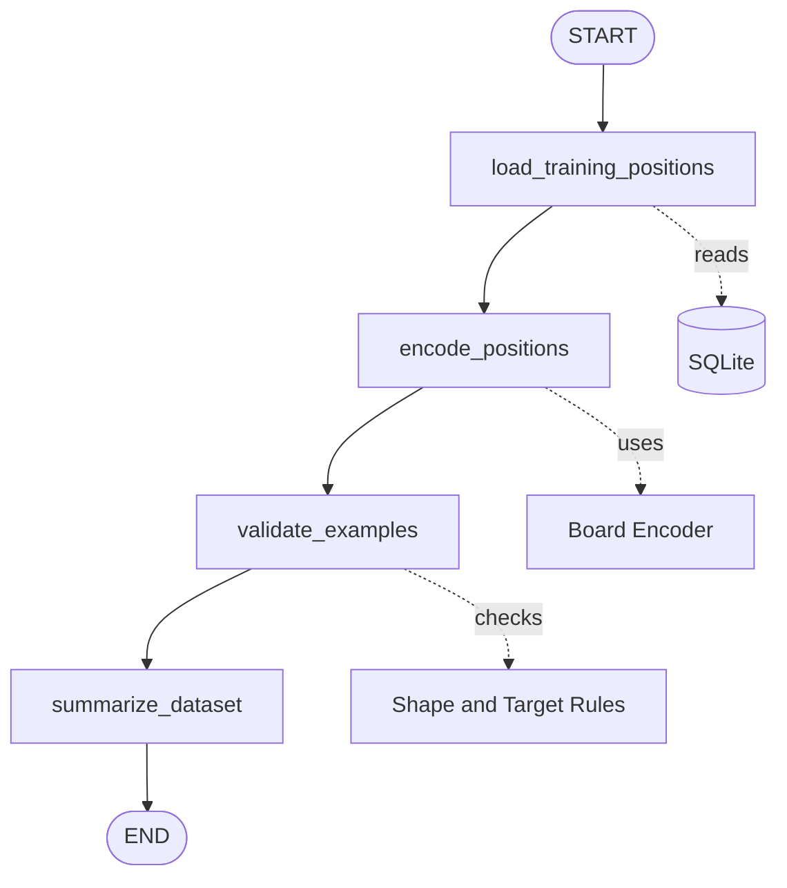
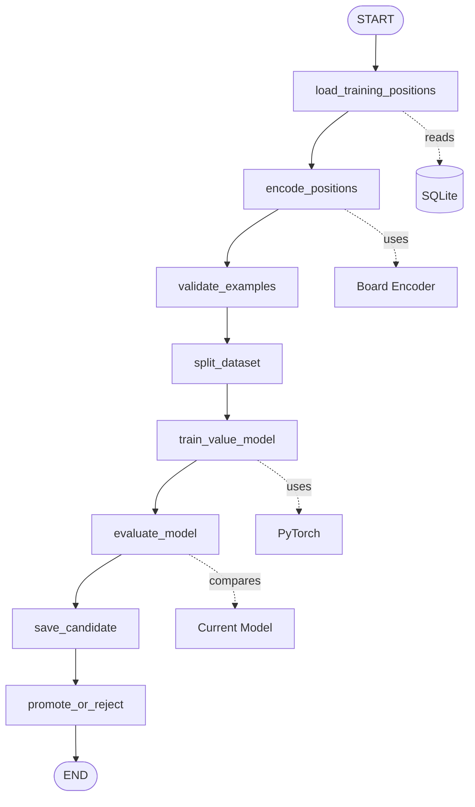

# LangGraph Workflow

LangGraph should orchestrate the ML pipeline. SQLite stores data, the encoder turns FEN strings into tensors, and PyTorch handles model training.

## Dataset Preparation



## State

```text
rows
  Raw rows from SQLite.

examples
  Encoded tensor and value target pairs.

bad_rows
  Rows that failed encoding or validation.

summary
  Counts and target distribution.
```

## Later Training Extension



The first graph should only prepare and validate data. Training comes after the data path is reliable.
